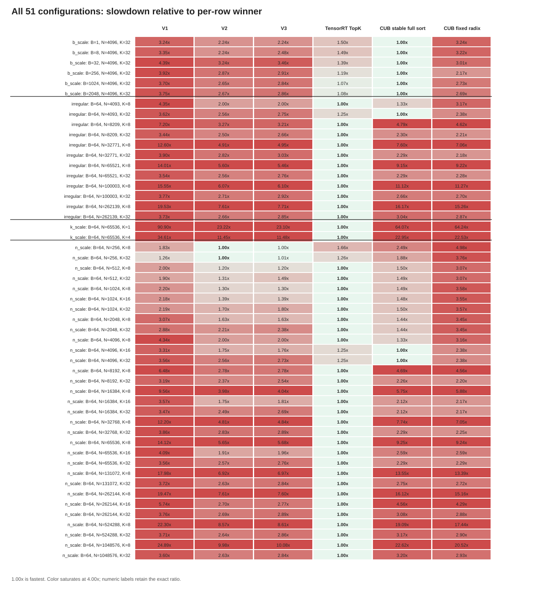
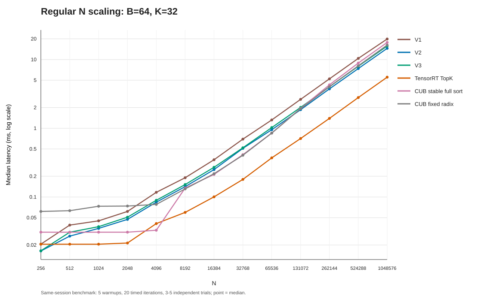
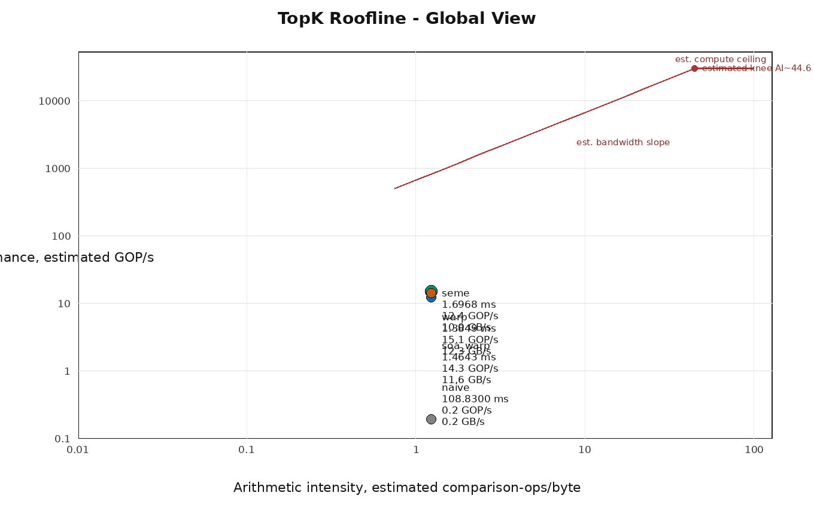

# TopK CUDA Kernel Lab

A CUDA TopK optimization lab with three user-kernel iterations, exact correctness tests, reproducible benchmarks, and TensorRT/CUB baselines. The optimized V2 and V3 implementations target `K <= 32`.

## Contents

- `kernels/`: baseline and V1/V2/V3 CUDA implementations
- `include/`: public launch interfaces and CUDA error helpers
- `tests/`: CPU-reference correctness suite, including ties and irregular sizes
- `benchmarks/`: CUDA-event benchmark harness and library baselines
- `scripts/`: debug/release build, test, sanitizer, benchmark, Nsight, and roofline helpers
- `reports/`: narrowly scoped public performance charts and summary CSV files

## Contract

- Input: row-major `float32 [batch, n]`
- Output values: row-major `float32 [batch, k]`
- Output indices: row-major `int32 [batch, k]`
- Ordering: largest values first
- User-kernel tie rule: lower original index wins
- V2/V3 supported domain: `k <= 32`

TensorRT TopK is an algorithm-matched baseline with relaxed tie-index ordering. CUB stable segmented sort is the strict-tie full-sort baseline, and CUB segmented radix sort is a fixed full-sort throughput baseline.

## Requirements

- Linux x86_64 with an NVIDIA GPU
- CUDA Toolkit 12.8 at `/usr/local/cuda-12.8`, or `CUDA_HOME` set to another installation
- CMake 3.22 or newer
- Ninja
- TensorRT development headers and `nvinfer`
- NVIDIA Compute Sanitizer for memory checks
- Nsight Systems and Nsight Compute for optional profiling

The published measurements were collected on an NVIDIA GeForce RTX 5070 12 GB with CUDA 12.8.

## Build

Debug build with device synchronization and CUDA debug information:

```bash
./scripts/build_debug.sh
```

Optimized release build:

```bash
./scripts/build_release.sh
```

Both scripts configure `CMAKE_CUDA_ARCHITECTURES=native`.

## Run

Run one release benchmark as `B N K iterations mode`:

```bash
./scripts/run_benchmark.sh 64 65536 32 50 v2
```

Supported performance modes include `v1`, `v2`, `v3`, `library_tensorrt_topk`, `library_cub_stable_segmented_sort`, and `library_cub_segmented_radix_sort`.

## Verify

Run the exact CPU-reference correctness suite for an optimized implementation:

```bash
./scripts/run_tests.sh v3
```

The test requires exact float value equality and exact output indices. User kernels use the lower original index to resolve equal-value ties.

Run Compute Sanitizer memcheck on the same implementation:

```bash
./scripts/run_memcheck.sh v3
```

## Benchmark Notes

The public sweep contains 51 configurations across `B=1..2048`, `N=256..1048576`, `K={1,4,8,16,32}`, plus irregular `N` values. Each reported point uses 5 warmups, 20 timed iterations, and at least 3 independent trials; seven noisy configurations use 5 trials. Charts report median latency.

CUDA events time only the target launch loop. Host/device allocation, input transfer, warmup, TensorRT engine construction, and execution-context creation are outside the timed region.







Compact public data:

- `reports/benchmark/full_scale_all_versions_summary_latest.csv`
- `reports/trends/full_scale_all_versions_wide_latest.csv`
- `reports/trends/full_scale_best_user_vs_baselines_latest.csv`

Raw profiler captures, correctness and sanitizer logs, benchmark trial dumps, and narrative analysis documents remain local-only.

## License

Licensed under the Apache License, Version 2.0. See `LICENSE`.
